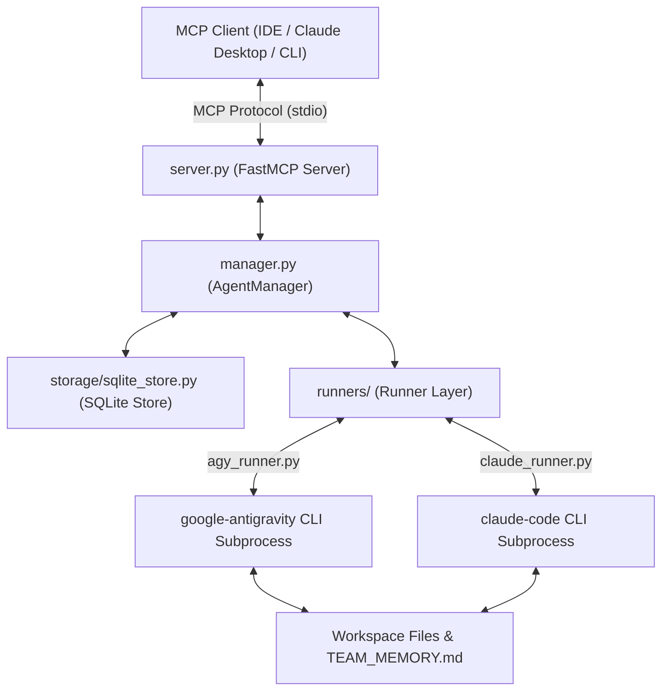

# Antigravity Supervisor MCP

An MCP server for orchestrating background AI coding agents locally.

Executing complex software engineering tasks within a single LLM chat session rapidly exhausts the model context window and blocks execution during long-running edits. Antigravity Supervisor MCP allows a primary LLM to delegate tasks to headless CLI agents running in background subprocesses, synchronizing work asynchronously without context bloat.

---

## Why this exists

### The Problem
When an AI coding assistant refactors multiple files, runs tests, or generates a project, all tool calls and outputs accumulate in a single conversation context. This leads to three main issues:

- **Context Exhaustion**: Large tool outputs consume context quickly, causing the model to forget earlier instructions or produce lower-quality output.
- **Synchronous Execution**: The primary model blocks while waiting for terminal commands or file modifications to complete.
- **Fragile Polling**: Custom agent setups often rely on continuous polling loops to monitor progress, consuming tokens and API requests unnecessarily.

### What this project changes
Antigravity Supervisor MCP provides a standard protocol interface for spawning subagents in background processes. Instead of performing edits directly, a primary LLM acts as an architect. It delegates tasks to background subagents (`google-antigravity` or `claude-code`), waits for completion using an event-driven mechanism, and collects structured results.

---

## Features

### Subprocess Agent Orchestration
Spawns background agent sessions in isolated directories using CLI binaries (`agy` or `claude`).
*Why it matters*: Isolates subagent tool calls and file context from the primary model's conversation window.

### Multi-Runner Backend Layer
Supports multiple CLI backends through a unified interface (`agy` for Gemini models, `claude` for Claude Code).
*Why it matters*: Prevents lock-in to a single LLM provider or CLI toolchain.

### Smart Synchronization (`wait_for_idle`)
Blocks orchestrator execution non-blockingly until a target background agent completes its task or times out.
*Why it matters*: Eliminates polling loops and wasteful token consumption while waiting for long-running operations.

### Implicit Team Memory
Injects workspace context and a shared `TEAM_MEMORY.md` directive into every subagent prompt automatically.
*Why it matters*: Allows subagents in the same workspace to coordinate architectural decisions and file contracts without manual prompt passing.

### SQLite Session Persistence
Stores session configurations, cursors, and event logs in an SQLite database (`sessions.db`).
*Why it matters*: Ensures session state and message history survive server restarts and crash events.

### Real Token Usage Accounting
Parses CLI `stream-json` events to track actual input and output tokens consumed per session and in aggregate.
*Why it matters*: Provides clear visibility into token costs across multi-agent workflows.

### Schema-Enforced Output
Supports requesting JSON outputs that conform strictly to a target JSON schema.
*Why it matters*: Ensures subagents return structured data suitable for automated verification or downstream logic.

### Surgical Code Repair (`apply_code_fix`)
Provides a direct find-and-replace tool for exact string edits, bounded by registered session workspaces.
*Why it matters*: Allows recovery when an autonomous agent struggles with line-replacement tools.

---

## Architecture



### Component Responsibilities

- **MCP Client**: The primary LLM or user environment (e.g., Claude Desktop, Antigravity IDE) that invokes MCP tools.
- **`server.py`**: The FastMCP entry point. Exposes tools (`spawn_agent`, `wait_for_idle`, `send_message`) and resources (`agy://logs/{session_id}`) over `stdio`.
- **`manager.py` (`AgentManager` & `Session`)**: Manages session state, process lifecycles, streaming event loops, and workspace security boundaries.
- **`runners/`**: Translates internal messages into CLI flag arguments (`build_command`) and parses standard output JSON events into canonical types (`parse_event`).
- **`storage/`**: Manages persistent storage of sessions and logs in SQLite using WAL mode and log rotation.
- **Workspace**: The target directory on disk where background agents execute tool calls and edit source files.

---

## How it works

Below is the step-by-step execution flow of a delegated task:

```
1. Client calls spawn_agent(session_id="auth-task", workspace_path="/path/to/app", runner="agy")
   ↓
2. Supervisor creates a Session record and stores metadata in SQLite
   ↓
3. Client calls send_message(session_id="auth-task", message="Implement JWT middleware")
   ↓
4. Manager injects workspace path and TEAM_MEMORY.md directive, then spawns the CLI subprocess
   ↓
5. Runner streams stdout line-by-line, parsing JSON events into canonical logs and token metrics
   ↓
6. Client calls wait_for_idle(session_id="auth-task") to block until completion
   ↓
7. Subprocess exits; wait_for_idle returns unread inbox messages and status to the Client
```

---

## Installation

### Prerequisites

- Python 3.9 or higher
- At least one supported agent CLI installed:
  - `google-antigravity` (`agy` binary) for Gemini backend
  - `@anthropic-ai/claude-code` (`claude` binary) for Claude Code backend

### One-Line Install

**Windows (PowerShell):**
```powershell
irm https://raw.githubusercontent.com/Inferno-Aditya/antigravity-mcp/main/install.ps1 | iex
```

**macOS / Linux (Bash):**
```bash
curl -sSL https://raw.githubusercontent.com/Inferno-Aditya/antigravity-mcp/main/install.sh | bash
```

### Manual Installation

1. Clone the repository:
   ```bash
   git clone https://github.com/Inferno-Aditya/antigravity-mcp.git
   cd antigravity-mcp
   ```

2. Install Python dependencies:
   ```bash
   pip install -r requirements.txt
   ```

3. Generate static JSON schemas for your MCP client (optional):
   ```bash
   python sync_schemas.py
   ```

---

## Quick Start

Add the server to your MCP client configuration file (e.g., `claude_desktop_config.json`):

```json
{
  "mcpServers": {
    "antigravity-supervisor": {
      "command": "python",
      "args": ["/absolute/path/to/antigravity-mcp/server.py"]
    }
  }
}
```

Once connected, delegate a task from your primary chat session:

```text
1. spawn_agent(session_id="refactor-db", workspace_path="/projects/my-app")
2. send_message(session_id="refactor-db", message="Migrate database connection pool to asyncpg.")
3. wait_for_idle(session_id="refactor-db")
```

---

## Available Tools

| Tool | Purpose | Returns | Example Call |
|---|---|---|---|
| `spawn_agent` | Initializes a background session. | Confirmation string. | `spawn_agent(session_id="s1", workspace_path="/app", runner="agy")` |
| `send_message` | Queues a prompt for execution. | Queue status message. | `send_message(session_id="s1", message="Run tests")` |
| `send_message_with_schema` | Queues a prompt with forced JSON schema output. | Queue status message. | `send_message_with_schema(session_id="s1", message="...", json_schema="{...}")` |
| `check_inbox` | Retrieves unread or all messages. | JSON payload with messages. | `check_inbox(session_id="s1", mode="read")` |
| `wait_for_idle` | Blocks non-blockingly until agent completes. | JSON payload of unread messages. | `wait_for_idle(session_id="s1", timeout_seconds=300)` |
| `get_agent_status` | Returns session state and token metrics. | JSON diagnostic object. | `get_agent_status(session_id="s1")` |
| `kill_agent` | Terminates a running agent process. | Status confirmation string. | `kill_agent(session_id="s1")` |
| `list_agents` | Lists all active and past sessions. | JSON array of sessions. | `list_agents()` |
| `get_model_usage` | Aggregates token usage across sessions. | JSON usage report. | `get_model_usage()` |
| `apply_code_fix` | Applies a surgical string replacement. | Execution result string. | `apply_code_fix(filepath="/app/main.py", target="old", replacement="new")` |

---

## Repository Structure

```
antigravity-mcp/
├── server.py              # Entry point exposing MCP tools and resources over stdio.
├── manager.py             # Core orchestrator handling session states, processes, and event dispatch.
├── sync_schemas.py        # Generates static JSON schemas for MCP clients requiring static files.
├── test_manager.py        # Integration smoke test suite for verifying runner execution.
├── install.ps1            # Automated installer for Windows environments.
├── install.sh             # Automated installer for POSIX environments.
├── install_helper.py      # Python script used by installers to update client config files.
├── MCP_REFERENCE.md       # API parameter details and schema reference manual.
├── TEAM_MEMORY.md         # Template shared memory blackboard file.
├── runners/               # CLI runner implementation module.
│   ├── base.py            # Abstract AgentRunner base class.
│   ├── agy_runner.py      # Google Antigravity CLI runner.
│   └── claude_runner.py   # Anthropic Claude Code CLI runner.
├── storage/               # Persistence layer module.
│   └── sqlite_store.py    # SQLite database transactions, WAL configuration, and log rotation.
└── .agents/               # Embedded skill configurations.
    └── mcp_orchestrator/  # Skill instructing primary LLMs to operate as delegating architects.
```

---

## Design Decisions

### Why SQLite
SQLite is included in the Python standard library, requiring no external server dependencies. Utilizing WAL mode allows synchronous writes with negligible latency while supporting concurrent reads. Persisting sessions to disk ensures work can be tracked or inspected across client restarts.

### Why Asynchronous Process Spawning
Executing background subagents in separate OS subprocesses prevents long-running operations (such as test suites or builds) from blocking the primary MCP server event loop.

### Why MCP (Model Context Protocol)
MCP provides an open standard interface supported by multiple IDEs and clients. Building on MCP allows any compatible client to manage multi-agent workflows without custom client extensions.

### Why Runner Abstraction Layer
CLI interfaces differ in flag syntax, session resumption flags (`--conversation` vs `--resume`), and event output formats. The `AgentRunner` base class encapsulates these differences, allowing new CLI tools to be integrated without altering core session logic.

### Why Shared Blackboard Memory (`TEAM_MEMORY.md`)
Passing large structural contexts repeatedly in prompts increases token usage. Injecting a reference to a shared file allows subagents in the same workspace to read and update shared constraints autonomously using standard file-system operations.

---

## Limitations

- **Local Execution Only**: Subagents execute on the local machine where the MCP server runs; distributed worker nodes are not currently supported.
- **CLI Dependency**: Requires locally installed and authenticated CLI binaries (`agy` or `claude`).
- **CLI Differences**: Features like `agent_type`, `reasoning_effort`, and `mode` are specific to `agy` and are ignored by the `claude` runner.

---

## Roadmap

- [x] `google-antigravity` (`agy`) runner support
- [x] Anthropic `claude-code` (`claude`) runner support
- [x] SQLite session persistence & WAL mode
- [x] Real-time token usage parsing
- [x] Static schema exporter (`sync_schemas.py`)
- [ ] Web-based session monitoring dashboard
- [ ] Remote execution over SSH / Docker containers
- [ ] Automated subagent retry policy on error

---

## Contributing

Contributions are welcome. To contribute:

1. Fork the repository and create a feature branch.
2. Ensure code conforms to Python standard formatting standards (`pep8` / `black`).
3. Run the integration test suite before submitting a pull request:
   ```bash
   python test_manager.py
   python test_manager.py --runner claude
   ```
4. Open a pull request describing the changes and motivation.

---

## License

Distributed under the MIT License. See [LICENSE](LICENSE) for details.
